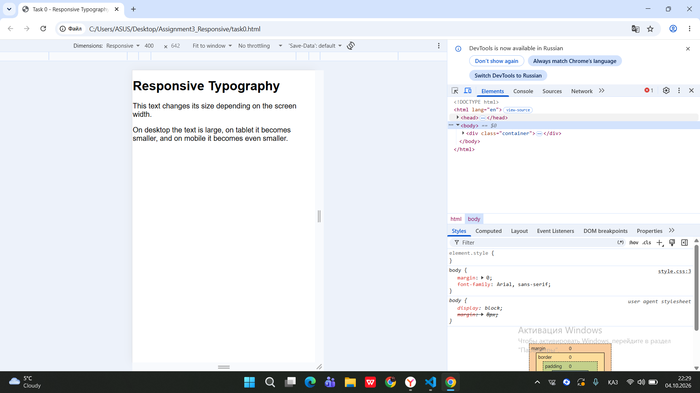
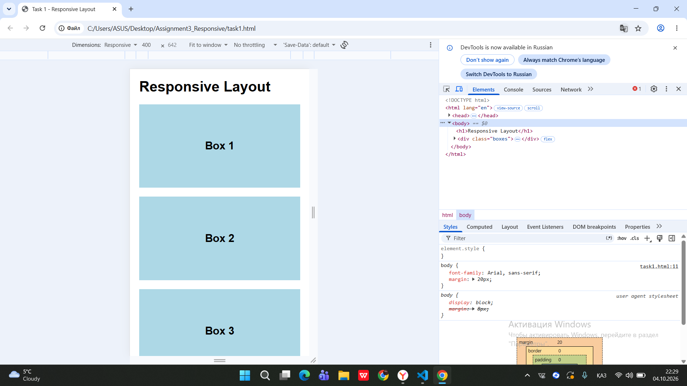
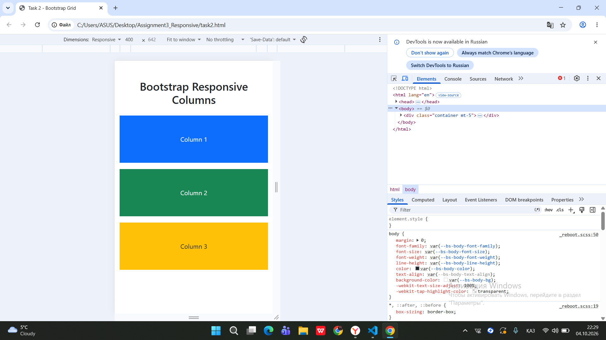
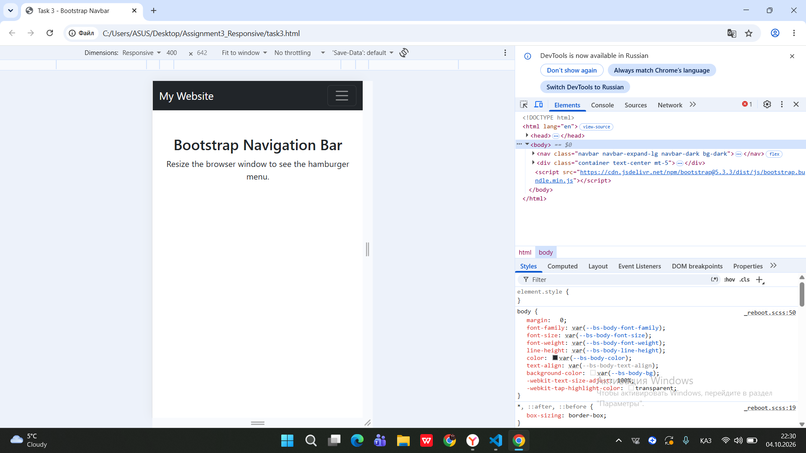
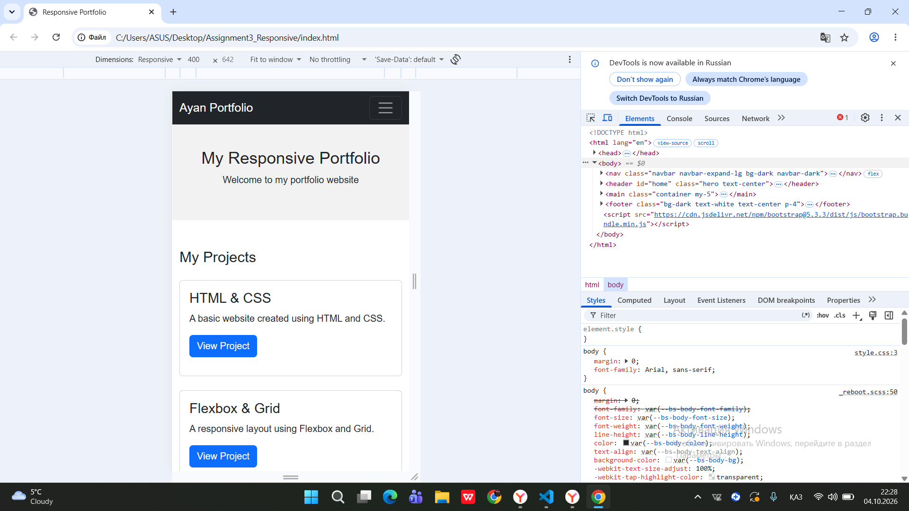

# Assignment #3 — Responsive Web Design

**Name:** Ayan Sarbasov
**Group:** SE2538

## Introduction

The goal of this assignment is to learn responsive web design using CSS Media Queries and the Bootstrap Grid system.

In this assignment, I created responsive web pages that work on desktop, tablet, and mobile screen sizes.

---

# Part 1 — Media Queries

## Task 0 — Responsive Typography

For Task 0, I created a simple webpage with headings and paragraphs.

I used CSS Media Queries to change the font size depending on the screen size.

* Desktop — large text
* Tablet — medium text
* Mobile — smaller text




---

## Task 1 — Responsive Layout with Media Queries

For Task 1, I created three boxes in a responsive layout.

The layout changes depending on the screen size:

* Desktop — three boxes in one row
* Tablet — two boxes in the first row and one box in the second row
* Mobile — all boxes are stacked vertically

This task was created using CSS Media Queries without Bootstrap.




---

# Part 2 — Bootstrap Grid System

## Task 2 — Bootstrap Responsive Columns

For Task 2, I used the Bootstrap 12-column grid system.

The columns change their size depending on the screen width.

* Desktop — three equal columns
* Tablet — two columns in the first row and one in the second row
* Mobile — all columns are stacked vertically

I used Bootstrap classes such as:

```text
col-lg-4
col-md-6
col-12
```




---

## Task 3 — Bootstrap Navigation Bar

For Task 3, I created a responsive navigation bar using Bootstrap.

The navigation bar contains:

* Logo
* Home
* About
* Projects
* Contact

On smaller screens, the navigation menu changes into a hamburger menu.




---

# Part 3 — Combined Project

## Task 4 — Responsive Portfolio Page

For Task 4, I combined CSS Media Queries and Bootstrap Grid to create a responsive portfolio page.

The portfolio page contains:

* Bootstrap responsive navbar
* Header section
* Projects section
* Project cards
* About Me sidebar
* Contact information
* Footer

Bootstrap Grid is used to arrange the project cards and sidebar.

CSS Media Queries are used to change font sizes, spacing, and layout for different screen sizes.



---

# Technologies Used

* HTML5
* CSS3
* CSS Media Queries
* Bootstrap 5
* Bootstrap Grid
* Bootstrap Navbar

---

# Project Structure

```text
Assignment3_Responsive/
│
├── index.html
├── style.css
├── task0.html
├── task1.html
├── task2.html
├── task3.html
├── README.md
│
└── screenshots/
    ├── task0.png
    ├── task1.png
    ├── task2.png
    ├── task3.png
    └── task4.png
```

---

# Work Process

First, I created separate HTML pages for the first tasks.

For Task 0, I used Media Queries to change the typography for different screen sizes.

For Task 1, I created three responsive boxes using CSS Media Queries.

For Task 2, I used the Bootstrap 12-column grid system to create responsive columns.

For Task 3, I created a responsive Bootstrap navigation bar with a hamburger menu for smaller screens.

Finally, I combined Media Queries and Bootstrap Grid in Task 4 to create a responsive portfolio page.

I tested the pages on different screen sizes and added screenshots for each task.

---

# Conclusion

This assignment helped me understand the basic principles of responsive web design.

I learned how to use CSS Media Queries to adapt a website to different screen sizes and how to use the Bootstrap Grid system and Navbar to create responsive layouts.
